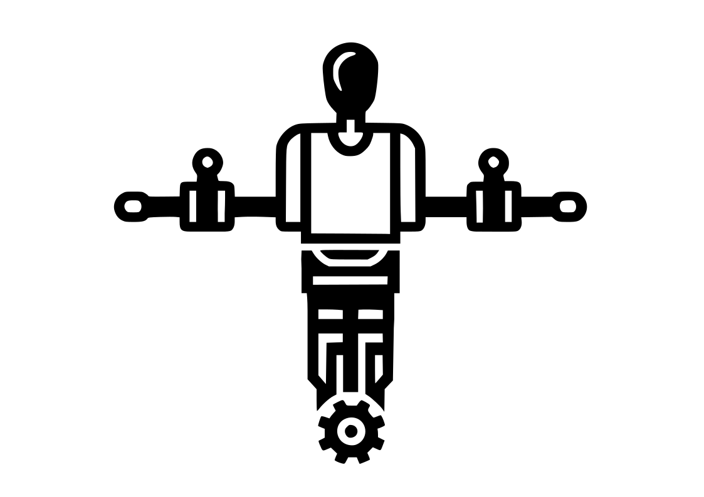
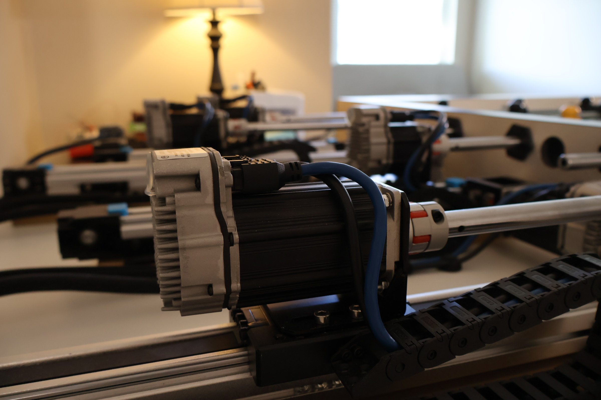

<h1 align="center">
  <picture></picture>
  <br />
  Foosbar
</h1>
<h2 align="center">
  The (Unverifiably but Plausibly) World's Best Foosball Robot
</h2>
<h2 align="center">
  Video explanation: https://www.youtube.com/watch?v=xrwXZXGiP1w
</h2>

# Pitch

As a very enthusiastic foosball player, I've sunk countless hours into the game. As a programmer though, something about the idea of practice is fundamentally misguided. Repeating the same task over and over, in the hopes of slightly improving your marginal efficiency of it? It sounds ripe for automation. 

So I did that! Foosbar is a completely autonomous foosball table that is robotically controlled on one side of the table, while a human plays on the other. It is capable of defending, passing and taking shots. It has successfully mechanized all my joy out of the game, leaving me free to pursue [more important and deeply fulfilling things](https://github.com/misprit7/computerraria) with my life.

<div align="center">
<picture ></picture>
</div>

# Setup

## Components

There are 3 main components of the project that I've dubbed `software`, `firmware` and `frontend`. `software` is the main directory for the code directly controlling the motors. `frontend` is for the 3d webapp enabling control of the table through a remote game controller. `firmware` is obsolete but originally for the teensy 4.1 mounted on the electronics connected to an e-paper display to show score, in the end I got lazy and didn't fully implement this.

Given that these are all very specific to my setup I don't anticipate anyone actually running any of this, so it's mostly here as reference for someone attempting something similar. Still, if only for my own sake here are some high level build instructions.

## `software`

You will need to build [uWebSockets](https://github.com/uNetworking/uWebSockets) and make it findable by cmake. Given that basically nobody as far as I can tell actually understands the arcane incantations required by cmake I'll tell you that I just ran `make && sudo cp ./uSockets/uSockets.a /usr/local/lib/libusockets.a` from inside the cloned directory. I'm sure that by saying so I'll get someone yelling at me that there's a more proper way though. You'll also need to install the [qualisys realtime sdk](https://github.com/qualisys/qualisys_cpp_sdk) in a similar way.

Once the requirements are installed, building is straightforward:

```
cd software
mkdir build && cd build
cmake ..
make
./foosbar
```

## `firmware`

Standard pio project, just run
```
cd firmware
pio run -t upload
```

## `frontend`

Just run
```
cd frontend
npm i
npm start
```

